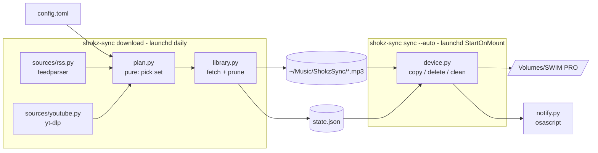
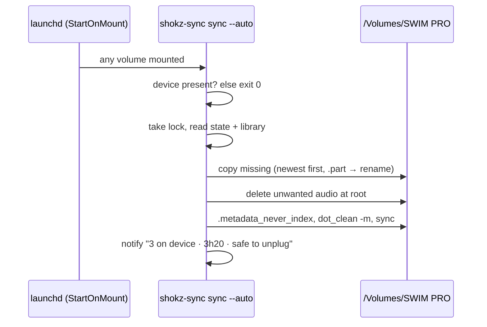

# Shape

A Python package `shokz-sync` (src layout, `pyproject.toml`, installed with `uv tool install .`) that exposes one console script, `shokz-sync`. It is built on the [Python stack decision](decision-python-stack.md).

# Components

| Module | Job |
|---|---|
| `config.py` | Load and save `~/.config/shokz-sync/config.toml`: `per_source = 1`, `total = 5`, `device = "SWIM PRO"`, `download_every_hours = 24`, `youtube_cookies_from = "chrome"`, `library = "~/Music/ShokzSync"`, and `[[sources]]` entries (`name`, `kind = "rss"\|"youtube"`, `url`, `enabled`). A missing file means defaults with no sources. |
| `state.py` | `~/Library/Application Support/shokz-sync/state.json`. Each item is keyed `<source>:<id>` with `title`, `published`, `file` and `status` (`wanted`, `dropped` or `skipped`). Each source has `last_run`, `last_ok` and `last_error`. Writes go to a temp file and are renamed into place. Two `fcntl` locks: `download` (one download at a time; a second exits with a message) and `commit` (held by sync, skip and the download's final commit, and waited on briefly). A slow download never blocks a plug-in sync, because fetching happens outside `commit`. |
| `sources/rss.py` | `newest(url, n)`: feedparser, keeping audio enclosures only. The ID is the guid (the enclosure URL if there is no guid) and `published` comes from the item's parsed date. `fetch(item, dest)`: stream the enclosure to a `.part` file; convert non-mpeg audio with ffmpeg; rename into place. |
| `sources/youtube.py` | `newest(url, n)`: YouTube's own Atom feed (`feeds/videos.xml?channel_id=` or `playlist_id=`; an @handle is resolved once from the channel page), parsed by feedparser, with Shorts skipped. The feed is not gated by the bot check. `fetch(item, dest)`: yt-dlp with format `ba[format_note*=original]/ba`, FFmpegExtractAudio to mp3 at quality 5. On a bot check it retries once with `cookiesfrombrowser = (youtube_cookies_from,)`, default `chrome`, and keeps the cookies for the rest of the run. |
| `plan.py` | Pure function `choose(candidates_by_source, state, per_source, total) -> list[Item]`. It drops skipped and dropped items, takes the newest `per_source` from each source, then the newest `total` overall, sorted newest first. |
| `library.py` | `download` command, in two steps. Fetch, outside the lock: for each enabled source, get candidates (record errors per source, keep going), plan, and fetch missing files. A file already on disk under an older name is renamed instead of downloaded again, and a failed download keeps the source's previous episode. Commit, under `commit`: re-read state (so a concurrent `skip` is kept), record source health, mark wanted and dropped, prune the library, save. |
| `device.py` | `find(name)` looks up `/Volumes/<name>`. `sync(plan, volume)` copies missing files newest first via `.part` then rename, checking free space with a 50 MB reserve. It then deletes root-level `*.mp3`/`*.m4a` files not in the plan, and never touches `SYSTEM/`, `System Volume Information/` or dot-folders. Finally it ensures `.metadata_never_index` exists, runs `dot_clean -m` and calls `os.sync()`. |
| `notify.py` | `osascript -e 'display notification ...'`. Failures are ignored. |
| `launchd.py` | `install` writes `~/Library/LaunchAgents/dev.shokz-sync.download.plist` (`StartInterval` = `download_every_hours` from config, default 24 h; `RunAtLoad` true) and `dev.shokz-sync.mount.plist` (`StartOnMount`), then bootstraps both. Each runs the absolute path of the `shokz-sync` script, with `PATH` including `/opt/homebrew/bin` for ffmpeg and deno, and logs to `~/Library/Logs/shokz-sync.log`. `uninstall` boots them out and deletes the plists. |
| `cli.py` | Typer app with Rich output. |

# Commands

| Command | Behaviour |
|---|---|
| `status` | Device connected?, what's on it, the wanted set with ✓/↓ markers, and per-source last run and error. |
| `sources list\|add\|rm\|enable\|disable` | Edit `config.toml`. `add` takes `NAME URL` and infers the kind (`youtube.com`/`youtu.be` means youtube, anything else rss). |
| `download` | Refresh the library. |
| `sync [--auto]` | Mirror the library to the device. `--auto` exits 0 silently if the device is absent and sends a notification when done. |
| `run` | `download` then `sync`. |
| `skip QUERY` | Mark the matching wanted item `skipped`, delete its file, and run the next `download` or `sync` to fill the slot. The query matches a case-insensitive substring of the title. It refuses if the query is ambiguous. |
| `doctor` | Check ffmpeg, deno, `dot_clean`, the yt-dlp version, config validity, whether the device is writable (a probe file) and the launchd agents. |
| `install` / `uninstall` | Set up or remove the launchd agents. |

# Files

The file name on disk is `<Source> - <Title>.mp3`, ASCII-folded and stripped of `/\:*?"<>|`, truncated to 120 characters, with ` [<6-char id hash>]` appended so equal titles never collide.

# Sync sequence on plug-in

The mount job does not download. Downloads run on the schedule, so the plug-in sync takes seconds.

# Failure behavior

- A source fails (network, parse, yt-dlp error): record `last_error`, keep that source's existing wanted items, and continue with the other sources. `status` shows the error in red.
- A download is interrupted: the `.part` file is left behind and removed on the next run. A file is only marked wanted once it is complete.
- The device is unplugged mid-copy: the `.part` file on the device is removed on the next sync. Delete runs after copy, so the device is never short.
- Not enough space: copy what fits (newest first), skip the rest, and say so in the notification.
- Concurrent runs: a second `download` exits with a message. `sync` waits for `commit` (60 s in auto mode, 5 s by hand), then gives up with a message.
- An empty library: `sync` refuses rather than wiping the device.

# Tests

pytest, run on the host with `uv run pytest`, no network:

- `plan.choose`: per-source and total caps, newest ordering, and skipped/dropped exclusion that lets the next item fill the slot.
- `rss.newest` against fixture XML: guid ID, dates, and non-audio enclosures ignored.
- `library` with fake sources: fetch missing, prune unwanted, mark dropped, keep going when a source errors.
- `device.sync` against a temp directory as the volume: copy order, delete after copy, protected folders untouched, `.part` cleanup, the space-reserve cutoff, and `dot_clean`/notify stubbed.
- `config` round-trip and `sources add` kind inference.
- CLI smoke tests through Typer's `CliRunner`.
- `launchd` plist rendering, checked as plist dicts (no bootstrap in tests).

The real device and real launchd are covered by the definition of done in [initiative](initiative.md).
